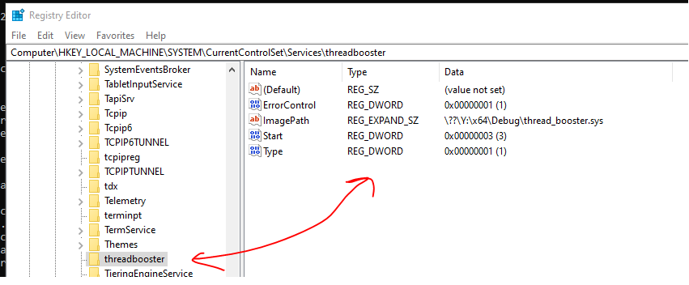
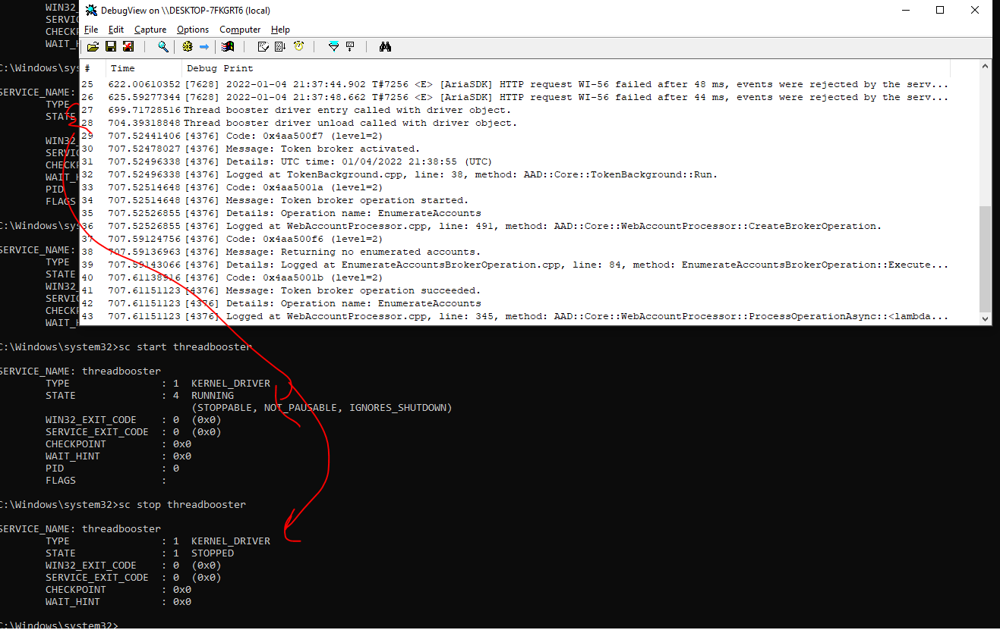

# Thread Booster Kernel Driver

## Load Driver:

```
C:\Windows\system32>sc
DESCRIPTION:
        SC is a command line program used for communicating with the
        Service Control Manager and services.

C:\Windows\system32>sc create threadbooster type= kernel binPath= Y:\x64\Debug\thread_booster.sys
[SC] CreateService SUCCESS

C:\Windows\system32>sc start threadbooster

SERVICE_NAME: threadbooster
        TYPE               : 1  KERNEL_DRIVER
        STATE              : 4  RUNNING
                                (STOPPABLE, NOT_PAUSABLE, IGNORES_SHUTDOWN)
        WIN32_EXIT_CODE    : 0  (0x0)
        SERVICE_EXIT_CODE  : 0  (0x0)
        CHECKPOINT         : 0x0
        WAIT_HINT          : 0x0
        PID                : 0
        FLAGS              :

C:\Windows\system32>

C:\Windows\system32>sc stop threadbooster

SERVICE_NAME: threadbooster
        TYPE               : 1  KERNEL_DRIVER
        STATE              : 1  STOPPED
        WIN32_EXIT_CODE    : 0  (0x0)
        SERVICE_EXIT_CODE  : 0  (0x0)
        CHECKPOINT         : 0x0
        WAIT_HINT          : 0x0

C:\Windows\system32>
```




### See KdPrint output

In windbg run,

> 1: kd> ed Kd_DEFAULT_Mask 0x8


<br>Then you can see `KdPrint` output in debugview sysinternals tool.
<br>



