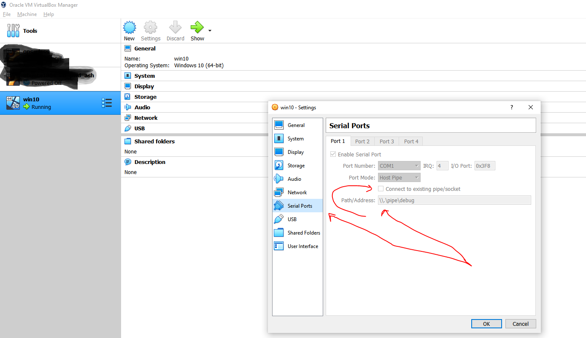
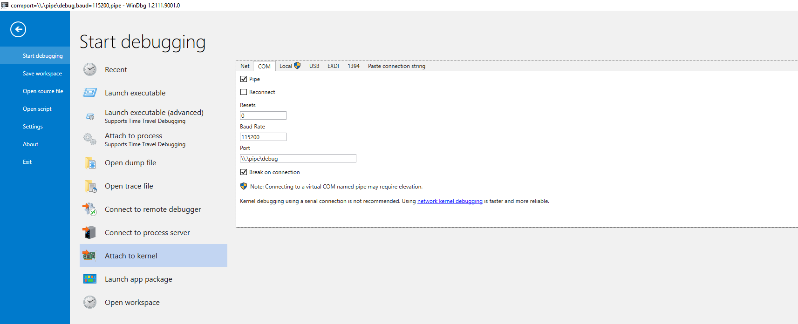
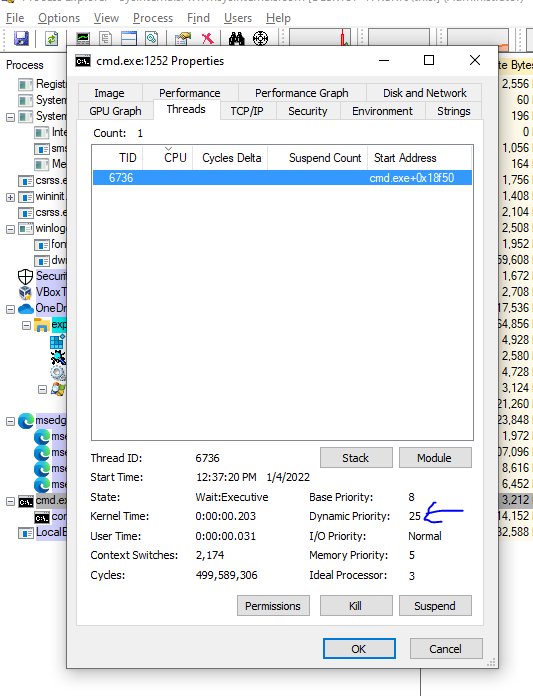

# Thread Priority Booster Kernel Driver
This is sample kernel driver that shows interaction between windows driver and a client.
This driver boosts priority of threads which is not possible from user mode.

## Set up for kernel debugging:
1. Create a windows VM
1. Enable testsigning for being able to load unsigned drivers.
1. Enable kernel debugging and attach through windbg.
```
# on guest VM
bcdedit /set testsigning on
bcdedit /debug on
bcdedit /dbgsettings serial debugport:1 baudrate:115200
```

Set com port in Virtual Box:
<br>

Attach to guest vm kernel through windbg:
<br>

## Load Driver:

```
C:\Windows\system32>sc
DESCRIPTION:
        SC is a command line program used for communicating with the
        Service Control Manager and services.

C:\Windows\system32>sc create threadbooster type= kernel binPath= Y:\x64\Debug\thread_booster.sys
[SC] CreateService SUCCESS

C:\Windows\system32>sc start threadbooster

SERVICE_NAME: threadbooster
        TYPE               : 1  KERNEL_DRIVER
        STATE              : 4  RUNNING
                                (STOPPABLE, NOT_PAUSABLE, IGNORES_SHUTDOWN)
        WIN32_EXIT_CODE    : 0  (0x0)
        SERVICE_EXIT_CODE  : 0  (0x0)
        CHECKPOINT         : 0x0
        WAIT_HINT          : 0x0
        PID                : 0
        FLAGS              :

C:\Windows\system32>

C:\Windows\system32>sc stop threadbooster

SERVICE_NAME: threadbooster
        TYPE               : 1  KERNEL_DRIVER
        STATE              : 1  STOPPED
        WIN32_EXIT_CODE    : 0  (0x0)
        SERVICE_EXIT_CODE  : 0  (0x0)
        CHECKPOINT         : 0x0
        WAIT_HINT          : 0x0

C:\Windows\system32>
```


### See KdPrint output

In windbg run,

> 1: kd> ed Kd_DEFAULT_Mask 0x8


<br>Then you can see `KdPrint` output in debugview sysinternals tool.
<br>


### Running client
Choose a thread id for any process. You can use sysinternals `process explorer` for this purpose.

```
C:\Windows\system32> y:\x64\Debug\thread_booster_client.exe 6736 25
Successfully set thread priority!!!
```


